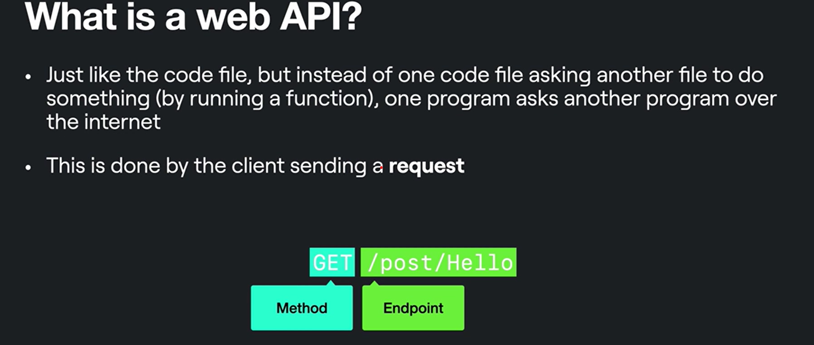
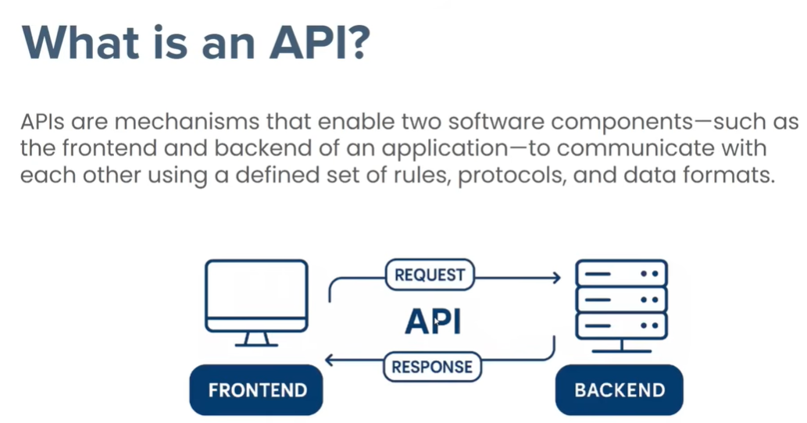

 
<h1> What is API </h1>

##  API stand for Application, Programming, interface 
- # 1️⃣ Application 👉 apps :
All Application are developed in code👨‍💻
  - mobile 📱
  - windows 💻
  - websites 🌎
  - IOT Devices 🏧

- # 2️⃣ Programming
Programming is set of instruction to the computer💻 to solve specific problems 

  - python
  - javascript
  - java
  - rust
  - go 
  - 

- # 3️⃣ Interface 
Interface : How things are allow to each other how to communicate two or many  application to each oter or interact

🟩 In Simple word is bridge🌉 of Communication between apps 

# What is Interface ?

    Example:
    A car's interface are steering wheel,the pedals,and the knobs in the dasboard 
    this interface bwtween car and driver🚓 using streering pedals ,dashboard 

---

<h1>

One More definition
</h1>
---
