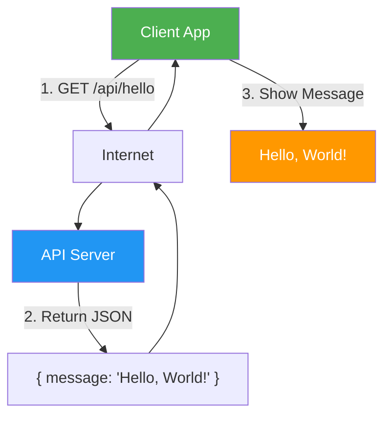

Here's a **super simple "Hello World" API flow diagram** using **Mermaid** — perfect for beginners, teaching, or quick demos.

---

##  1️⃣ Hello World" API Example

**Scenario:**  
Your app calls `GET /api/hello` → Server returns `"Hello, World!"`

---

### Mermaid Flowchart (Simple & Clean)



---

### How to Use It
1. Go to: [https://mermaid.live](https://mermaid.live)
2. Paste the code above
3. See the clean, beautiful diagram!

---

### Real cURL Test

```bash
curl https://api.example.com/api/hello
```

**Response:**
```json
{ "message": "Hello, World!" }
```

---


