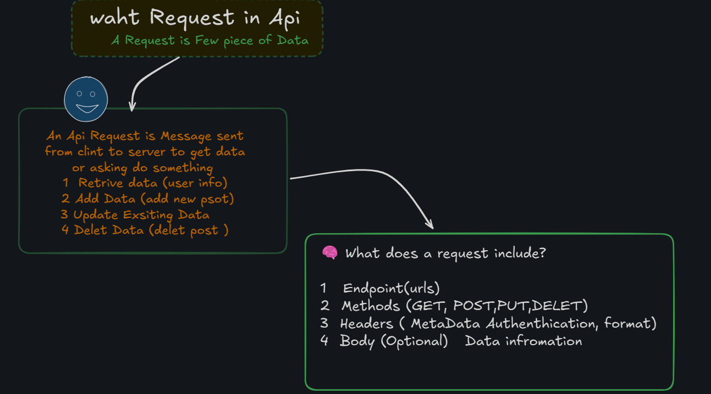
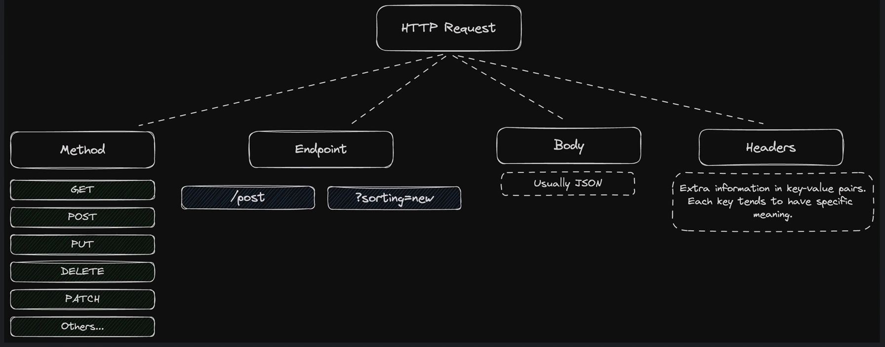
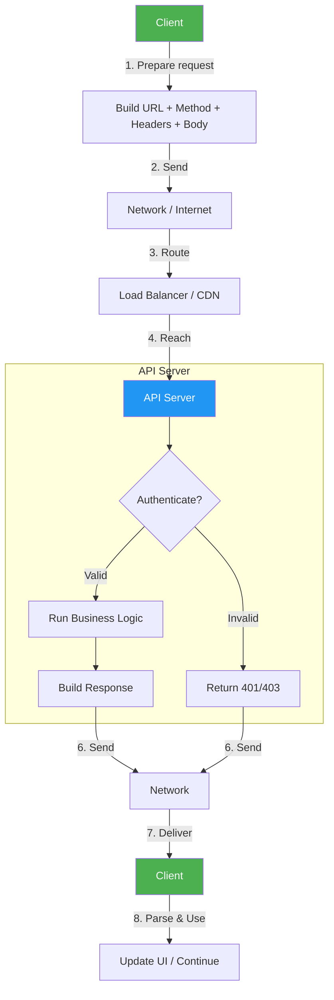

<div align="center">

<h1> What is Request </h1>

</div>

<hr>



<hr>




<hr>

In an **API** (Application Programming Interface), a **request** is how a client (like your app, website, or program) asks a server to perform an action or provide some data.

Let’s break it down simply 👇

---

### 🧩 **What is an API request?**

An **API request** is a message sent from a **client** to a **server**, asking it to do something — such as:

* Retrieve data (like user info or weather)
* Create new data (like adding a new post)
* Update existing data
* Delete data

---

### 🧠 **What does a request include?**

An API request usually has these parts:

| Part                   | Description                                 | Example                         |
| ---------------------- | ------------------------------------------- | ------------------------------- |
| **Endpoint (URL)**     | The address of the API you’re calling       | `https://api.example.com/users` |
| **Method (HTTP verb)** | The action you want to perform              | `GET`, `POST`, `PUT`, `DELETE`  |
| **Headers**            | Metadata (like authentication, format info) | `Authorization: Bearer <token>` |
| **Body (optional)**    | Data you send to the server (for POST/PUT)  | `{ "name": "Alice" }`           |

---

### ⚙️ **Example**

If you wanted to get a list of users from an API:

```http
GET https://api.example.com/users
```

If you wanted to add a new user:

```http
POST https://api.example.com/users
Content-Type: application/json

{
  "name": "Alice",
  "email": "alice@example.com"
}
```

---

### 🗣️ **In short**

> A “request” in an API is how your program *asks* a server for something — it’s like saying, “Hey server, please give me this data,” or “Hey, please save this new record.”

---


Below is a **step-by-step explanation** of how a typical **API request works**, followed by a **text-based flow diagram** (using Mermaid syntax) that you can copy-paste into any Mermaid renderer (e.g., [mermaid.live](https://mermaid.live), VS Code, Obsidian, etc.).

---

## How an API Request Works (Simple Flow)

| Step | Actor | Action |
|------|-------|--------|
| 1 | **Client** (browser, mobile app, server) | Prepares the request: URL, HTTP method (`GET`, `POST`, …), headers, body (if any). |
| 2 | **Client** | Sends the request over the network (HTTP/HTTPS) to the **API endpoint**. |
| 3 | **Network / Load Balancer** | Routes the request to the correct server. |
| 4 | **API Server** | Receives the request, parses it, validates authentication (API key, JWT, OAuth, etc.). |
| 5 | **API Server** | Executes business logic (queries DB, calls other services, runs calculations). |
| 6 | **API Server** | Builds a response (status code, headers, JSON/XML payload). |
| 7 | **API Server** | Sends the response back over the network. |
| 8 | **Client** | Receives the response, parses it, updates UI or continues processing. |

---

## Flow Diagram (Mermaid)



### How to view it
1. Go to **[mermaid.live](https://mermaid.live)**
2. Paste the code block above (including the triple backticks).
3. The diagram renders instantly.

---

## Quick Example (cURL)

```bash
curl -X POST "https://api.example.com/v1/users" \
     -H "Authorization: Bearer <token>" \
     -H "Content-Type: application/json" \
     -d '{"name":"Alice","email":"alice@example.com"}'
```

- **Client** → `curl`
- **API Server** → validates token, creates user, returns `201 Created` with user JSON.

---

Let me know if you want:
- A **sequence diagram** (actor-timeline view)
- **Error handling** branch
- **Async / Webhook** flow
- Export as PNG/SVG

Happy coding! 🚀


<div align="center">
<h3> Happy Learning by Muhammad Babar 🥰</h3>
</div>


```mermiad 
    flowchart TD
        A[Client] -->|1. Prepare request| B[Build URL + Method + Headers + Body]
        B -->|2. Send| C[Network / Internet]
        C -->|3. Route| D[Load Balancer / CDN]
        D -->|4. Reach| E[API Server]
    
        subgraph API Server
            E --> F{Authenticate?}
            F -->|Valid| G[Run Business Logic]
            F -->|Invalid| H[Return 401/403]
            G --> I[Build Response]
        end
    
        I -->|6. Send| J[Network]
        H -->|6. Send| J
    
        J -->|7. Deliver| K[Client]
        K -->|8. Parse & Use| L[Update UI / Continue]
    
        style A fill:#4CAF50,color:#fff
        style E fill:#2196F3,color:#fff
        style K fill:#4CAF50,color:#fff
```